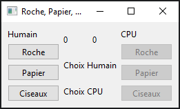
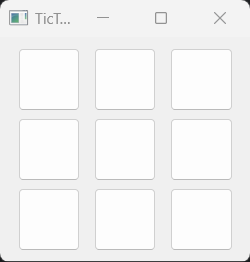

# Roche, Papier. Ciseaux

## Recréer l'interface d'un jeu de Roche, Papier, Ciseaux
1) Recréer l'interface ci-dessous avec les divers gestionnaires de géométrie (layouts) dans la classe
RochePapierCiseaux(QMainWindow)
   1) L'interface est constituée
      1) d'une section pour le joueur humain 
      2) d'une section pour la table de jeu
         1) Contient le score pour l'humain et le cpu (QLabel)
         2) Contient 2 QLabels qui permettra d'afficher le choix de chaque joueur
      3) d'une section pour le joueur cpu (est similaire à la section humain mais avec les widgets désactivés)
      

2) Créer une classe Joueur avant votre classe RochePapierCiseau
   1) Le joueur devra avoir
      1) nom: string
      2) score: int
      3) isCpu: boolean

3) Implémenter un jeu de base de Roche, Papier, Ciseaux
   1) instancier les deux joueurs (humain et cpu)
   2) connecter le choix de l'humain à une méthode qui pourra gérer le choix
   3) utiliser un choix au hasard pour le cpu (ex: Random.choice())
   4) Résoudre le gagnant
      1) Afficher les choix de chaque Joueur sur la table de jeu avec les images png correspondantes (essayez de limiter la grandeur)
      2) Augmenter le score du Joueur gagnant
      3) Afficher le nouveau score dans les QLabel

<a href="https://www.flaticon.com/free-icons/rock" title="rock icons">Rock icons created by Icongeek26 - Flaticon</a>  
<a href="https://www.flaticon.com/free-icons/origami" title="origami icons">Origami icons created by Smashicons - Flaticon</a>  
<a href="https://www.flaticon.com/free-icons/scissors" title="scissors icons">Scissors icons created by Gulraiz - Flaticon</a>

# Un autre classique - TicTacToe
1) Créer l'interface pour un jeu de TicTacToe de base à deux joueurs
 
2) Utiliser un QGridLayout pour l'aire de jeu
3) Chaque case comprendra un QPushButton
   1) faire une seule méthode à conecter et obtenir le nom du widget appelant:  
   >def bouton_clicked(self):  
   >  widget_origine = self.sender()  
   >  nom_widget = widget_origine.objectName()
4) Chaque widget dans une case aura une grandeur de 50x50 (i.e. QSize(50, 50))
5) Lorsque cliqué, un bouton sera remplacé par un QLabel qui affichera le pion du joueur courant ("X" ou "O")
   1) Optionel: Remplacer le texte du QLabel par des icônes de votre choix
6) Créer une classe JeuTicTacToe() qui représente le modèle du jeu
   1) Devra initialiser deux joueurs
   2) Devra contenir une structure de données pour représenter le plateau de jeu, ex:
   >self.plateau = [  
   >         [" ", " ", " "],  
   >         [" ", " ", " "],  
   >         [" ", " ", " "]  
   >  ]
   3) *Petit truc*: Initialiser la classe de jeu dans le constructeur de la Fenêtre Principale et passer une référence de la fenêtre principale (vue) au constructeur de la classe de Jeu pour avoir une référence à la vue.
   4) Implémenter la logique qui alterne chaque joueur à jouer
   5) Implémenter une méthode qui vérifie s'il y a un gagnant
      1) En cas de gagnant, afficher un QDialog qui affichera le nom du gagnant
7) Créer une classe Joueur() pour représenter les joueurs
   1) Devra contenir un nom: str et un pion: str
8) Si vous pouvez, ajouter la logique qui reset le Jeu mais garde le score entre les deux joueurs (ajouter les éléments de UI pour afficher le score.)

